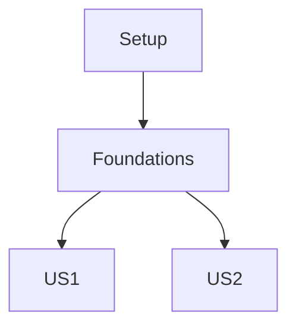

# Tasks: {{FEATURE_NAME}} ([{{BRANCH_NAME}}])

## Implementation Strategy

- **MVP Focus**: Implement User Story 1 first to validate the core flow.
- **Incremental Delivery**: Each phase produces a testable increment.
- **Parallelization**: Tasks marked with `[P]` can be executed in parallel within their phase.

## Parallel Execution Guide

- **Phase 1**: Setup tasks are sequential.
- **Phase 2**: Independent models can be built in parallel.
- **Phase 3+**: Different stories can be implemented in parallel if they don't share dependencies.

## Dependency Graph

## Phase 1: Setup

**Goal**: Initialize project structure and dependencies.

- [ ] T001 Initialize project structure ({{FEATURE_DIR}})

## Phase 2: Foundations

**Goal**: Core shared components.

- [ ] T002 Implement base classes

## Phase 3: User Story 1

**Goal**: {{US1_GOAL}}
**Independent Test**: {{US1_TEST_CRITERIA}}

- [ ] T003 [US1] Implement ...

## Final Phase: Polish

**Goal**: Cleanup and optimization.

- [ ] T999 Cleanup temporary files
