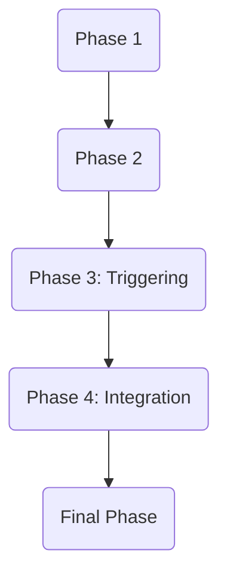

# Tasks: Agent Communication Server ([001-agent-comms-server])

## Implementation Strategy

- **MVP Focus**: Implement Server Infrastructure and Core Orchestration (US1 & US2) to enable basic agent triggering.
- **Incremental Delivery**: Start with the server shell, then add the agent registry, and finally the streaming endpoint.
- **Parallelization**: Agent registry and CORS configuration can be implemented in parallel.

## Parallel Execution Guide

- **Phase 3 (US1)**: Agent registry (T006) and CORS setup (T007) are independent.
- **Phase 4 (US2)**: Endpoint implementation depends on registry (T006).

## Dependency Graph

## Phase 1: Setup

**Goal**: Initialize project structure and dependencies for the FastAPI server.

- [ ] T001 Install dependencies (FastAPI, uvicorn, sse-starlette) in `requirements.txt`
- [ ] T002 Create backend directory structure (`backend/app`, `backend/agents`)

## Phase 2: Foundations

**Goal**: Core shared components and server shell.

- [ ] T003 Implement `backend/app/main.py` with basic FastAPI app shell
- [ ] T004 [P] Create `backend/agents/registry.py` scaffold (empty dict/class)
- [ ] T005 Create `backend/app/models.py` for `ChatRequest` Pydantic model

## Phase 3: User Story 1 (Agent Triggering)

**Goal**: User can trigger an agent action via the server.
**Independent Test**: Send a request to the server and receive a response (even if mock) from an agent context.

- [ ] T006 [P] [US1] Implement Agent Registry logic in `backend/agents/registry.py` to map `agent_id` to Agent classes
- [ ] T007 [P] [US1] Configure CORSMiddleware in `backend/app/main.py` allowing `localhost:3000`
- [ ] T008 [US1] Implement orchestration logic in `backend/app/services/orchestrator.py` to load agent by ID
- [ ] T009 [US1] Create mock Agent classes in `backend/agents/mock_agents.py` for testing registry

## Phase 4: User Story 2 (Frontend Integration/SSE)

**Goal**: Frontend can connect via SSE and receive streamed thoughts/results.
**Independent Test**: `curl` request to endpoint returns stream of `text` and `result` events.

- [ ] T010 [US2] Implement `POST /api/chat` endpoint in `backend/app/routers/chat.py` using `StreamingResponse`
- [ ] T011 [P] [US2] update `backend/app/main.py` to include chat router
- [ ] T012 [US2] Implement SSE generator function in `backend/app/services/sse_generator.py` to format events

## Final Phase: Polish

**Goal**: Cleanup and verification.

- [ ] T013 Verify standard `ag-ui` protocol compliance (event names: text, result, etc.)
- [ ] T014 Remove mock agents and connect real `orchestrator` agent (if available)
