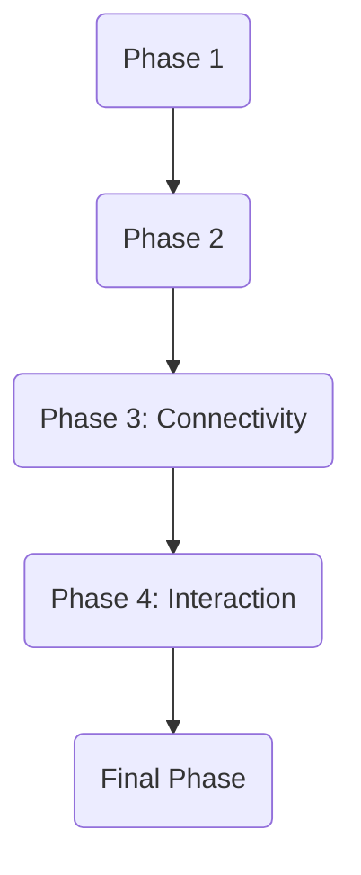

# Tasks: CopilotKit Integration ([001-copilotkit-integration])

## Implementation Strategy

- **MVP Focus**: Implement the adapter skeleton and register the endpoint to verify connectivity (US2).
- **Incremental Delivery**: Start with basic text streaming, then add tool call mapping.
- **Parallelization**: Adapter implementation and Main registration can be parallel.

## Parallel Execution Guide

- **Phase 2**: T004 is independent of internal adapter logic.
- **Phase 3**: Logic implementation task T005.

## Dependency Graph

## Phase 1: Setup

**Goal**: Initialize dependencies.

- [x] T001 Install `copilotkit` library in `requirements.txt` or environment

## Phase 2: Foundations

**Goal**: Core adapter structure and server integration.

- [x] T002 Create `backend/agents/adapter.py` with `ADKCopilotAgent` class skeleton (implements strict CopilotKit protocol)
- [x] T003 Implement `backend/app/main.py` import of `add_fastapi_endpoint` and `CopilotKitRemoteEndpoint`

## Phase 3: User Story 2 (Session Initialization)

**Goal**: Frontend can connect to the backend endpoint.
**Independent Test**: `curl POST /copilotkit` returns 200 OK or expected stream headers.

- [x] T004 [US2] Register `/copilotkit` endpoint in `backend/app/main.py` using `add_fastapi_endpoint` with `ADKCopilotAgent` instance

## Phase 4: User Story 1 (User Chat Interaction)

**Goal**: Full chat loop with streaming.
**Independent Test**: Send messages payload, receive streamed text and tool events.

- [x] T005 [US1] Implement request parsing in `backend/agents/adapter.py` to extract messages
- [x] T006 [US1] Implement `stream` method in `ADKCopilotAgent` to invoke `google.adk.Agent`
- [ ] T007 [US1] Implement mapping of ADK `ToolCall`/`ToolResult` to CopilotKit text content events in `backend/agents/adapter.py`
- [ ] T006 [US1] Implement event mapping (Text chunks) from ADK to CopilotKit in `backend/agents/adapter.py`
- [ ] T007 [US1] Implement event mapping (Tool calls) from ADK to CopilotKit in `backend/agents/adapter.py`

## Final Phase: Polish

**Goal**: Cleanup and verification.

- [ ] T008 Verify standard `ag-ui` protocol compliance via CopilotKit SDK
- [ ] T009 Ensure no "mock" logic remains in adapter
