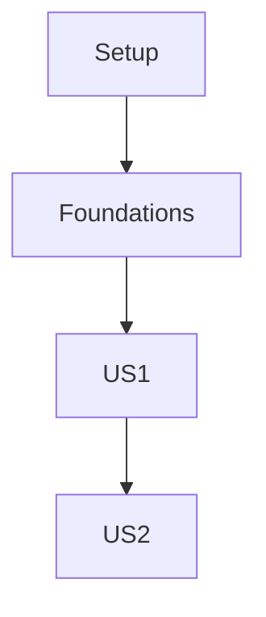

# Tasks: CopilotKit Integration ([002-copilotkit-integration])

## Implementation Strategy

- **MVP Focus**: Implement the streaming endpoint (US1) immediately to unlock frontend development.
- **Incremental Delivery**: Start with basic text streaming, then add tool events (US2).
- **Parallelization**: Frontend component integration can happen while backend endpoint logic is being refined.

## Parallel Execution Guide

- **Phase 1**: Setup is sequential.
- **Phase 2**: Frontend wrapper and Basic Backend Endpoint can potentially be started in parallel.
- **Phase 3**: Tool events depend on the basic streaming mechanism being in place.

## Dependency Graph

## Phase 1: Setup

**Goal**: Prepare environment and dependencies.

- [x] T001 Install `ag-ui-adk` in backend `requirements.txt`
- [x] T002 Install `@copilotkit/react-core` and `@copilotkit/react-ui` in frontend `package.json`

## Phase 2: Foundations & User Story 1 (Chat & Streaming)

**Goal**: Enable basic text chat with the agent via CopilotKit.
**Independent Test**: User types a message, backend responds with streamed text.

- [x] T003 [US1] (Skipped) Backend endpoint provided by `ag-ui-adk` at `/agent-default`
- [x] T004 [US1] (Skipped) Backend endpoint provided by `ag-ui-adk` at `/agent-default`
- [x] T005 [US1] (Skipped) Backend endpoint provided by `ag-ui-adk` at `/agent-default`
- [x] T006 [US1] (Skipped) Logic already in `backend/app/main.py`
- [x] T007 [P] [US1] Configure `CopilotKit` provider in `frontend/app/layout.tsx` (point to `/agent-default`)
- [x] T008 [P] [US1] Add `CopilotSidebar` or Chat component to `frontend/app/page.tsx`

## Phase 3: User Story 2 (Tool Usage)

**Goal**: Visualize agent tool verification/usage in the UI.
**Independent Test**: Agent invokes a tool, UI shows "Processing..." or tool output.

- [ ] T009 [US2] Verify `ag-ui-adk` tool event formatting in backend agent response loop
- [ ] T010 [US2] (Optional) Create custom CopilotKit renderers for specific tool outputs if default UI is insufficient

## Final Phase: Polish

**Goal**: Cleanup and optimization.

- [ ] T011 Verify CORS settings for new endpoint compatibility
- [ ] T012 Run full conversation test to ensure session continuity (via context passing)
